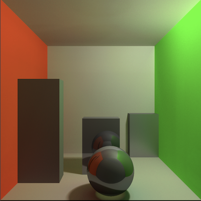
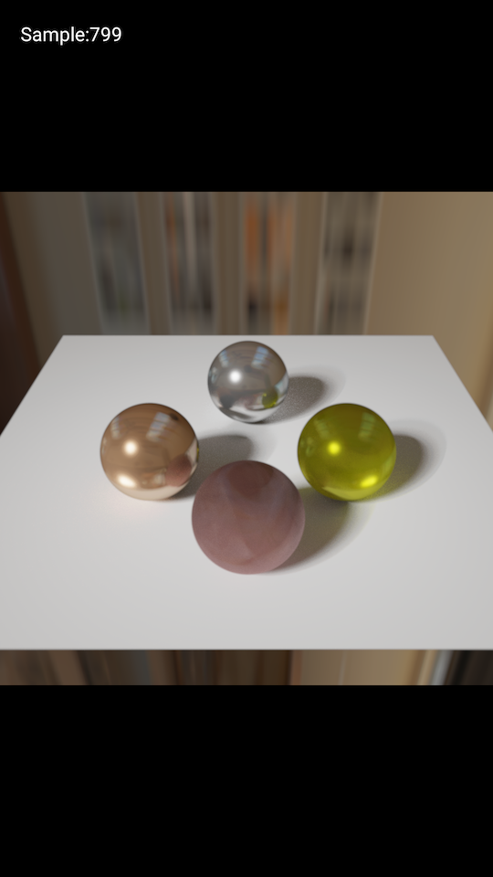
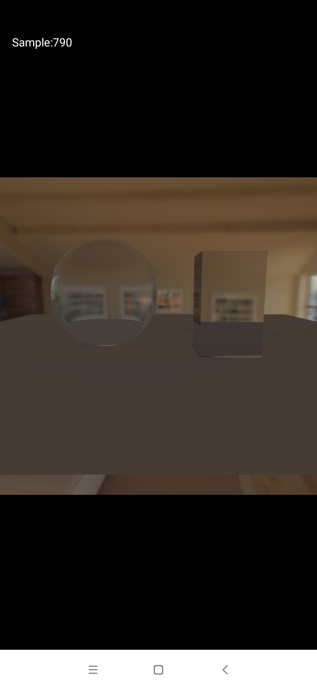

# AndroidRayTracing

A simple realtime Path Tracer demo for android implemented with GLES 3.0

- progressive render, with float texture supported, it will be converge about 500~700 samples

- soft shadow is implement by randomly jitter the light position per-pixel, which is inspired by this [project](https://github.com/evanw/webgl-path-tracing)

- BRDF PBR material support, and IBL environment lighting

- Depth of field

Known problems:

- after about 1000 times samples, it may be occur some overfitting problems, may be because of the distribution of random function implemented in GLSL is not truly uniform 

### TODO:

- Texture Support
- BVH && Model Loading

------

Cornell Box(with Motion Blur): 

PBR Sphere:

Glass:

Depth Of Field

